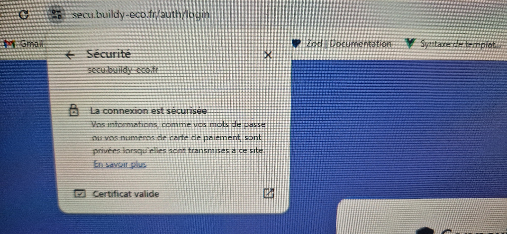
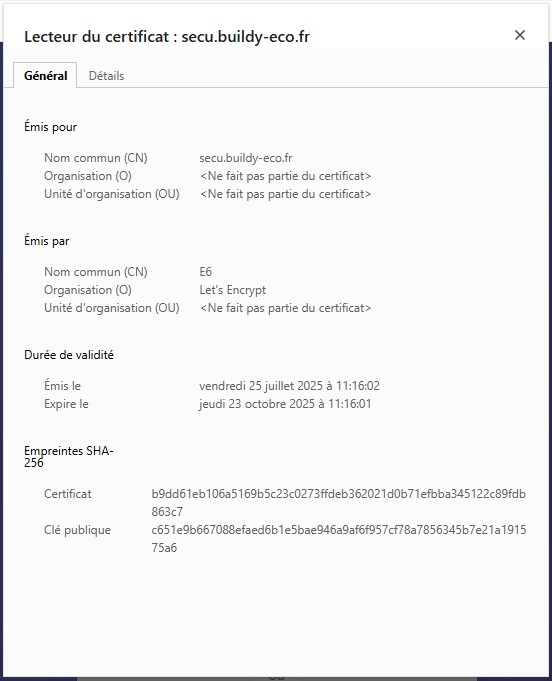
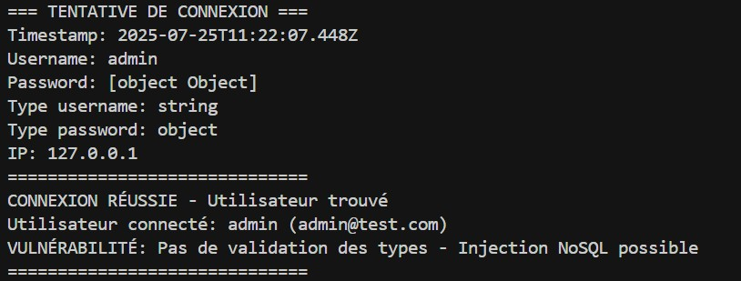
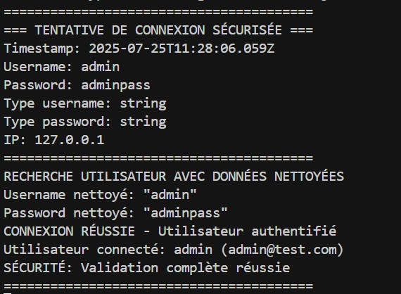
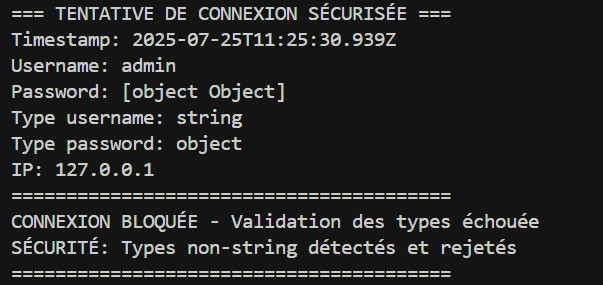
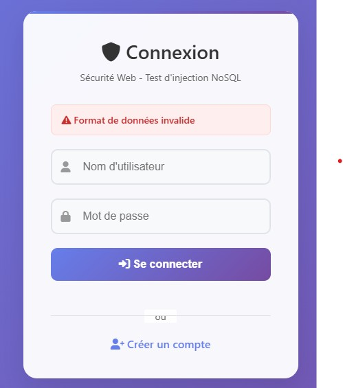
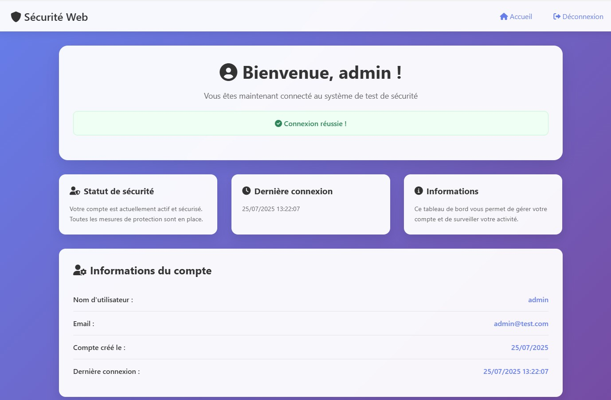

# Rapport Technique - Sécurité Web : Injection NoSQL et Configuration HTTPS

**Étudiant :** Hemavathi BIRABOURAME, Ines HADIDI
**Module :** Sécurité Web  
**Classe :** 5IW3  
**URL de production :** https://secu.buildy-eco.fr

---

## Table des matières

1. [Configuration HTTPS avec Let's Encrypt](#configuration-https-avec-lets-encrypt)
2. [Vulnérabilité d'Injection NoSQL](#vulnérabilité-dinjection-nosql)
3. [Remédiation et Sécurisation](#remédiation-et-sécurisation)
4. [Démonstrations et Tests](#démonstrations-et-tests)
5. [Annexes techniques](#annexes-techniques)

---

## Configuration HTTPS avec Let's Encrypt

### Certificat SSL et Configuration

L'application est déployée en production avec un certificat SSL valide généré par Let's Encrypt. La configuration HTTPS est complète avec redirection automatique HTTP vers HTTPS.

#### Preuve du certificat SSL

**Capture 1 : Indicateur de sécurité HTTPS**


**Capture 2 : Détails du certificat SSL**


#### Configuration Nginx

```nginx
server {
    listen 80;
    server_name secu.buildy-eco.fr;
    return 301 https://$server_name$request_uri;
}

server {
    listen 443 ssl;
    server_name secu.buildy-eco.fr;
    
    ssl_certificate /etc/letsencrypt/live/secu.buildy-eco.fr/fullchain.pem;
    ssl_certificate_key /etc/letsencrypt/live/secu.buildy-eco.fr/privkey.pem;
    
    # Headers de sécurité
    add_header Strict-Transport-Security "max-age=31536000; includeSubDomains" always;
    add_header X-Frame-Options DENY always;
    add_header X-Content-Type-Options nosniff always;
    add_header X-XSS-Protection "1; mode=block" always;
    
    location / {
        proxy_pass http://localhost:3000;
        proxy_set_header Host $host;
        proxy_set_header X-Real-IP $remote_addr;
        proxy_set_header X-Forwarded-For $proxy_add_x_forwarded_for;
        proxy_set_header X-Forwarded-Proto $scheme;
    }
}
```

#### Automatisation Let's Encrypt

```bash
# Génération du certificat
sudo certbot --nginx -d secu.buildy-eco.fr --non-interactive --agree-tos

# Renouvellement automatique (crontab)
0 12 * * * /usr/bin/certbot renew --quiet
```

---

## Vulnérabilité d'Injection NoSQL

### Description de la vulnérabilité

L'application présente une vulnérabilité d'injection NoSQL sur le système d'authentification. Cette faille permet à un attaquant de contourner l'authentification en injectant des opérateurs MongoDB malveillants.

#### Code vulnérable

```javascript
router.post('/login', async (req, res) => {
    const { username, password } = req.body;
    
    // VULNÉRABILITÉ : Pas de validation des types
    const user = await User.findOne({ username: username, password: password });
    
    if (user) {
        // Connexion réussie même avec des données malveillantes
    }
});
```

#### Mécanisme d'exploitation

L'opérateur `$ne` (not equal) de MongoDB peut être injecté pour contourner l'authentification :

- **Payload :** `{"$ne": null}`
- **Effet :** Retourne tous les documents où le champ password n'est pas égal à `null`
- **Résultat :** Connexion réussie malgré un mot de passe incorrect

### Démonstration de l'exploitation

**Vidéo 1 : Exploitation de la vulnérabilité**
<video width="100%" controls>
  <source src="images/faille.mp4" type="video/mp4">
  Votre navigateur ne supporte pas la lecture de vidéos.
</video>

Cette vidéo montre l'exploitation réussie de l'injection NoSQL avec le payload `{"$ne": null}`.

## Remédiation et Sécurisation

### Implémentation des corrections

La version sécurisée implémente plusieurs couches de protection :

#### 1. Validation stricte des types

```javascript
if (typeof username !== 'string' || typeof password !== 'string') {
    return res.render('login', { error: 'Format de données invalide' });
}
```

#### 2. Validation de la longueur des entrées

```javascript
if (username.length < 3 || username.length > 50) {
    return res.render('login', { error: 'Nom d\'utilisateur invalide' });
}

if (password.length < 6) {
    return res.render('login', { error: 'Mot de passe trop court' });
}
```

#### 3. Nettoyage des données

```javascript
const cleanUsername = username.trim();
const cleanPassword = password.trim();
```

#### 4. Validation email avec regex

```javascript
const emailRegex = /^[^\s@]+@[^\s@]+\.[^\s@]+$/;
if (!emailRegex.test(email)) {
    return res.render('register', { error: 'Format d\'email invalide' });
}
```

### Démonstration de la correction

**Vidéo 2 : Test de la version sécurisée**
<video width="100%" controls>
  <source src="images/sans_faille.mp4" type="video/mp4">
  Votre navigateur ne supporte pas la lecture de vidéos.
</video>

Cette vidéo montre que l'injection NoSQL est maintenant bloquée par les validations de sécurité.

## Démonstrations et Tests

### Tests de validation

#### Test 1 : Connexion normale (succès)

**Données de test :**
- Username : `admin`
- Password : `adminpass`

**Résultat attendu :** Connexion réussie

#### Test 2 : Tentative d'injection (échec)

**Données de test :**
- Username : `admin`
- Password : `{"$ne": null}`

**Résultat attendu :** Connexion bloquée

### Captures d'écran des logs

Les captures suivantes montrent les logs en temps réel lors des tests :

**Capture 3 : Logs de la version vulnérable**


**Capture 4 : Logs de la version sécurisée**


**Capture 5 : Test d'injection bloquée**



**Capture 6 : Connexion normale réussie**


---

## Annexes techniques

### A.1 Script de déploiement automatisé

Le script `deploy.sh` automatise l'ensemble du processus de déploiement.

### A.2 Commandes de test

#### Test de la vulnérabilité

```bash
npm install
# Démarrage de la version vulnérable
npm start

# Test d'injection dans le navigateur
# Username: admin
# Password: {"$ne": null}
```

#### Test de la correction

```bash
npm install
# Démarrage de la version sécurisée
npm run start:secure

# Test d'injection (doit échouer)
# Username: admin
# Password: {"$ne": null}

# Test de connexion normale (doit réussir)
# Username: admin
# Password: adminpass
```

### A.3 Configuration PM2

Avec le fichier ecosystem.config.sh

## Conclusion

Ce projet démontre l'importance de la validation des entrées utilisateur dans les applications web. L'implémentation d'une vulnérabilité d'injection NoSQL et sa correction illustrent les bonnes pratiques de sécurité web.

La configuration HTTPS avec Let's Encrypt assure la confidentialité des données en transit, tandis que les validations de sécurité empêchent les attaques par injection.

L'ensemble du projet est documenté avec des démonstrations vidéo et des captures d'écran qui facilitent la compréhension des concepts de sécurité implémentés. 